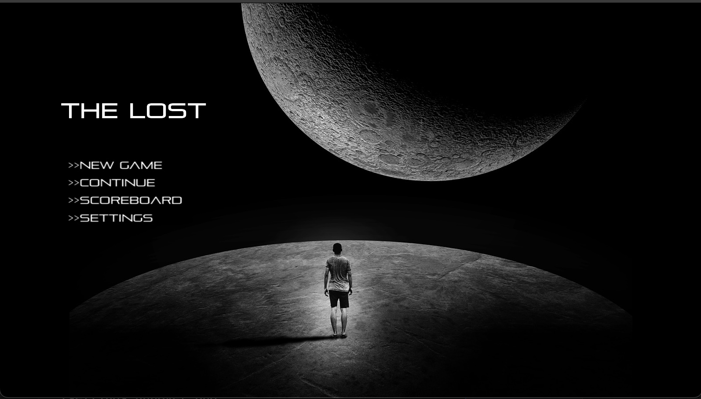

# 2024 I2P Final Project - RPG

## Member : 周伯穎，李岱淩，陳柏蓉

**Game type**
This is a RPG game about a man trying to recover back his memory
and his past
**Gameplay**
Use `A` and `D` to move left and right, there are occasions for
`W` and `S` key to climb up and climb down a ladder.
Use `I` key to interact with structure and `C` key to close it.
Use `E` key to enter a door and enter password.
Use `ESC` key to pause and save.
Use `B` key to gain access to backpack.
Use `P` key to pick up item.
| **Project Tasks**           | **Score** | **Check** |
| :-------------------------- | :-------: | :-------: |
| Add `ScoreboardScene`       |    40%    |     -     |
| Enemy Pathfinding           |    10%    |     -     |
| 2 New Turrets/Enemies/Tools |    20%    |     -     |

---

